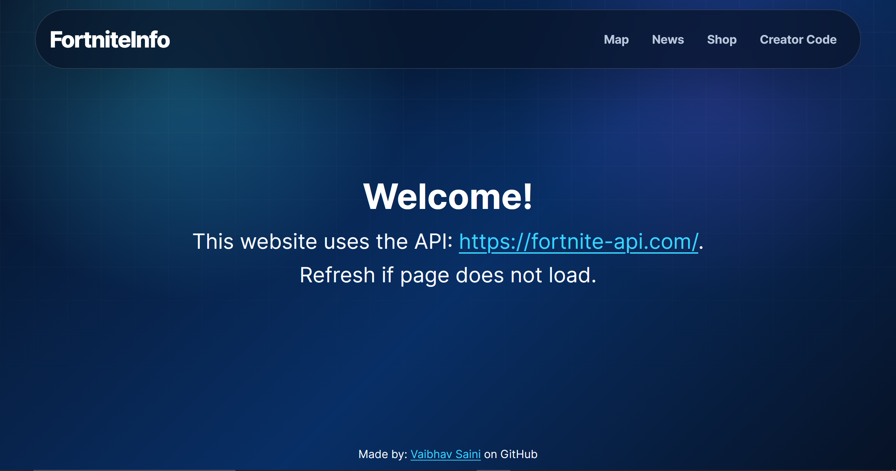

# 🎮 FortniteInfo

A modern Fortnite companion web app that displays the **current map, live news, item shop**, and allows users to **validate creator codes** — all in one place.

---

## 🚀 Features

- 🗺️ **Live Map Viewer**
  - View current Fortnite map (with and without POIs)
  
- 📰 **News Feed**
  - Battle Royale, Save The World, and Creative news sections

- 🛒 **Item Shop**
  - Displays current shop items, bundles, and pricing
  - Dynamic rarity-based visuals

- ✅ **Creator Code Validator**
  - Check if a creator code is active in real-time

- ⚡ **Fast & Optimized**
  - Lazy loading with `React.lazy` and `Suspense`
  - Memoized components to reduce unnecessary re-renders

- 📱 **Progressive Web App (PWA)**
  - Installable on desktop and mobile
  - Service worker enabled for faster load times

- 📐 **Responsive Design**
  - Works across mobile, tablet, and desktop devices

---

## 🛠️ Tech Stack

- **Frontend:** React (Vite)
- **Routing:** React Router
- **PWA:** Workbox / Vite PWA Plugin  
- **API:** [Fortnite API](https://fortnite-api.com/)  
- **Styling:** CSS (custom responsive design)

---

## 🌐 Live Demo

👉 https://fortnite-info.netlify.app/

---

## ⚠️ Notes

> If content does not load, refresh the page.  
> This may happen due to API response delays.

---

## 📦 Installation & Setup

```bash
# Clone the repository
git clone <your-repo-url>

# Navigate into the project
cd FortniteInfo

# Install dependencies
npm install

# Run development server
npm run dev
```

---

## 📸 Preview




---

## 👨‍💻 Author

- Vaibhav Saini  
- GitHub: https://github.com/vaibhav-saini-dev

---

## ⭐ Future Improvements

- Better error handling for API failures  
- Caching for offline support  
- UI/UX redesign (V3 styling 👀)  
- Search & filtering for shop items  
